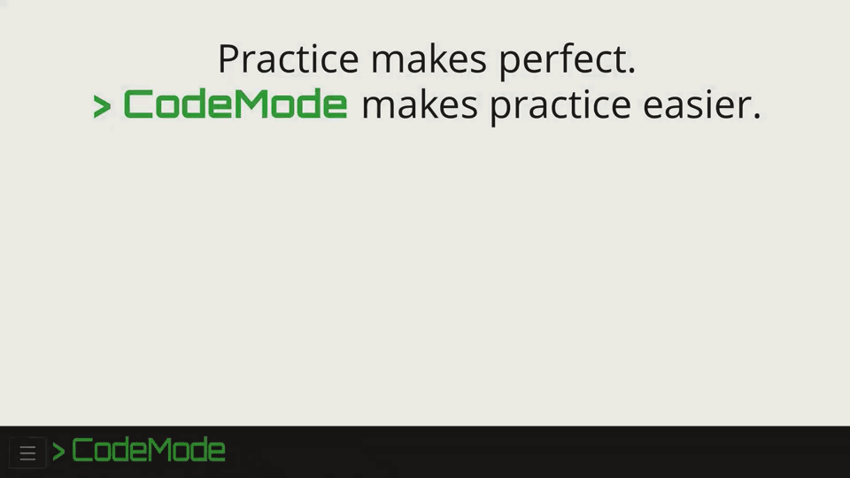
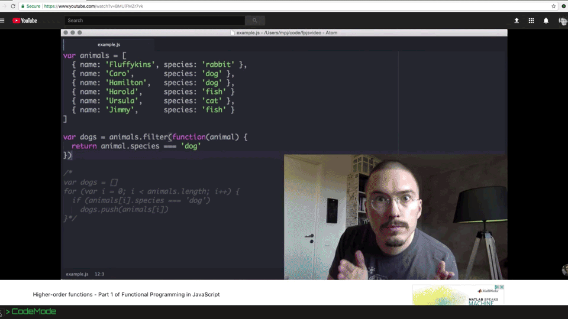

# > CodeMode

## CodeMode overview

CodeMode is a Google Chrome extension that turns any Youtube coding tutorial into an interactive learning platform. Activate CodeMode by [installing the extension on the Chrome Web Store](https://chrome.google.com/webstore/detail/code-mode/lojikgkcpdeolbgbfcapfpfhofkocnge).


### Why CodeMode?

Youtube has invaluable educational videos and active communities of content creators and students. Unfortunately, for those students ot practice what they're learning, they have to find the video's sample code somewhere else on the web (if the content creator has made it available), open a separate tab or program to work, and constantly switch between these windows in order to follow along.

CodeMode simplifies this process and **makes practice easier**.



### How does it work?

CodeMode dramatically simplifies the process of coding along to Youtube videos by adding a drawer to the bottom of the video's page. Users can toggle this drawer open and code inside of its code editor. CodeMode keeps track of questions assigned to individual videos so viewers can practice the skills they are learning without having to leave the page. Finally, content creators can contribute to the videos and questions in the CodeMode database.



### Learn more

You can [view the CodeMode product demo on Youtube](https://youtube.com/watch?v=H9oYe_8Ks9M) to learn more about how we created CodeMode.


# For developers

## How to run CodeMode locally

- Open your terminal window, navigate to your desired directory, and type the following:
```bs
> git clone git@github.com:World-of-Code/code-mode.git
> cd code-mode
> yarn
> yarn run start-dev
```
- Open up Chrome and go to `chrome://extensions`.
- Make sure the 'Developer Mode' checkbox is on
- Click 'Load unpacked extension...'
- Navigate to the folder with CodeMode's `manifest.json` file and click 'Select'
- Now you should be able to navigate to [any Youtube video](https://www.youtube.com/watch?v=H9oYe_8Ks9M) and see the CodeMode drawer at the bottom of the page!

## Known issues

- When multiple Youtube videos are open in separate tabs, CodeMode forces each page to reload continuously.


## Style guide

- Pay attention to the linter
- Do not use semicolons
- use `const` or `let` over `var`
- Use `require` and `module.exports` in .js files
- Use `import` and `export` in .jsx files
- Put `import` statements at top
- Put the `default export` at bottom
- Consider splitting up any file larger than 100 lines
- Name files using lowercase-and-dashes instead of camelCase or PascalCase, except for when the default export is a class
- Define React components as pure functions (instead of classes) whenever possible

## Technologies

React
Redux
PostgreSQL
Express
Node
Mocha/Chai

## Acknowledgements

**Made with ❤ by**
- [Andrew Ziegler](https://github.com/apdjz),
- [Kyle Uehlein](https://github.com/kuehlein),
- [Mariel Werner](https://github.com/marielwerner), and
- [Veekas Shrivastava](https://github.com/veekas).

Special thanks to the team at [Fullstack Academy](https://github.com/fullstackacademy) for making this team and project possible.
